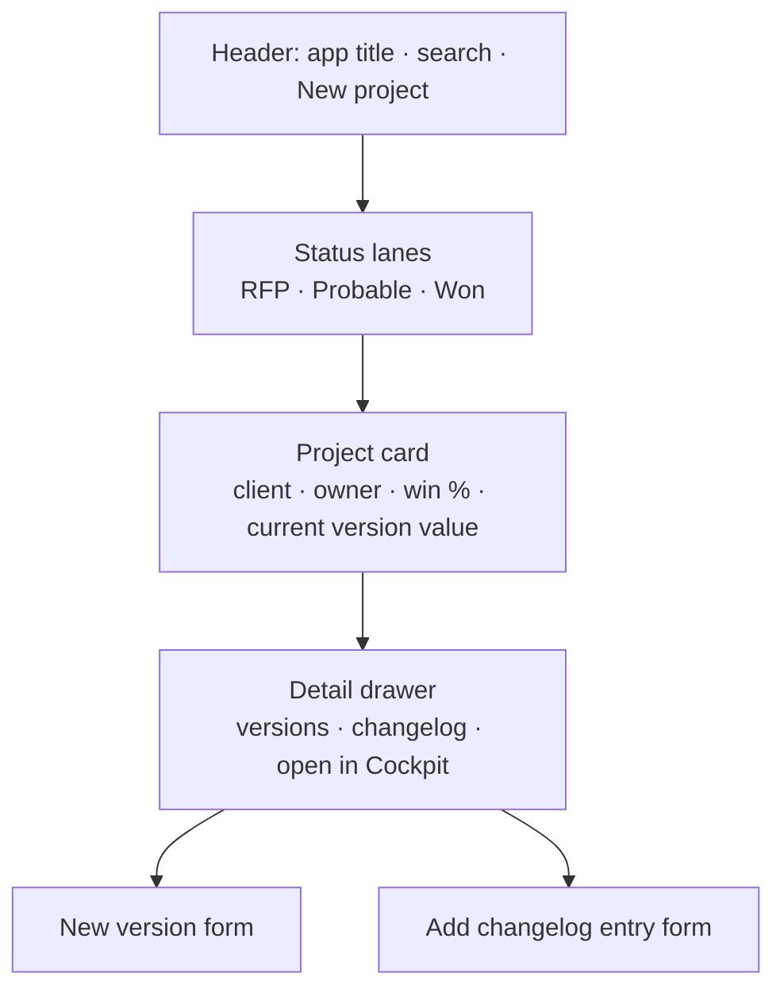

# Clinical Trials Pricing Application — Frame UI Briefing

2026-09-20 · @Tom

## 1. Objective and scope

Build a Frame-based alternative to the four boards that carry the application's story — portfolio, timeline, cashflow, executive summary — alongside the existing native boards, leaving the data model and every current board untouched. Both UIs read and write the same blocks, so a user, or a demo, can switch between the native and Frame version of the same screen. The result is a demo-grade front end for the estimating app and a reusable Frame kit for later client work.

**Why Frames, and why these four.** The app has zero Frames today, 22 boards (7 parked) and up to 300 orphaned views. Its story is told across four boards that are mostly charts, KPIs and status tables — exactly what Frames do better than native widgets. The estimating grid and the assumption tables are the opposite: dense editable pivots that Pigment renders well and a Frame would render worse.

| Screen | Treatment | Reason |
| --- | --- | --- |
| 2. Project & Budget Creation | **Frame 1 — Portfolio** alongside the native board | Cards and a status lane beat three list grids; project and version creation become forms |
| 5. Timeline Planning (+ Timeline block of 4. Assumptions) | **Frame 2 — Timeline** alongside | The only real input is 8 month counts; a draggable Gantt is the natural UI |
| 8. Cashflow Profile | **Frame 3 — Cashflow** alongside | The showpiece chart; milestone schedule becomes an editable stepped timeline |
| 00. Executive Summary | **Frame 4 — Cockpit** alongside | Read-only terminal page today; becomes the page a CFO opens first |
| 0. INTRO | Unchanged, plus a "Frame view" card group | Entry point to both UIs |
| 6. Project Task Estimate | Native only | 17-metric editable pivot with cell-level access rights; a Frame would write one cell at a time |
| 4. Assumptions, 5. Countries & Sites | Native only | Input tables; low demo value |
| 7. Benchmark, 9. Department Review, 10. Client Pricing, 11. Resource Summary | Phase 2 Frame candidates | Benchmark and Resource Summary are chart-heavy and would Frame well once the four above are done |

**In scope for this brief:** UX and interaction design for Frames 1–4, the backing Views each needs, the bindings, the shared visual system, the links between each Frame and its native counterpart, and the data fixes the Frames depend on. **Out of scope:** removing or modifying any existing board, any change to metric formulas beyond the fixes in §11, the estimating engine, access rights redesign, and the parked boards.

## 2. Current architecture — what the Frames sit on

The model is a single-scenario, dimension-list-only application (59 lists, 185 metrics, 23 tables, no transaction lists) whose spine is the `Project Version` list (`5a4f5a85-…`). 150 of the 185 metrics carry it; every time-phased metric is monthly on the `Month` list (`b3c1a1ef-…`, 204 periods). All ids below are from the 20 Sep extract.

**Key blocks by Frame**

| Frame | Reads | Writes |
| --- | --- | --- |
| 1 Portfolio | Lists `Project` (`7d4aa709-…`: Name, Client→`Client`, Owner→`Team`, Project Status→`Project Status`, Win Likelyhood formula), `Project Version` (`5a4f5a85-…`: Project, Version→`Version`, Version Type→`Version Type`, Date Initiated, Date Released), `Change Log` (`297f4a64-…`); metric `Price (with Tasks)` (`61bc84a1-…`) aggregated to PV for card values | `addItem` / `editItem` on the three lists |
| 2 Timeline | `Milestone - Months` (`2399554e-…`, TS × PV, input), `Milestone - From` / `- To` (`5950c727-…` / `5c6f947b-…`), `Milestone_Period` (`d80aa426-…`, TS × PV × Month), `Milestone_Period_Multi_Stages` (`a154b2a2-…`, Dual Timeline Stages × PV × Month), `Start Date` (`4fb85253-…`) | `editValue` on `Milestone - Months`, `Start Date` |
| 3 Cashflow | Table `[TBL] Cashflow Summary` (`ec2e3300-…`: `Cash Receipts` `8535c37a-…`, `Phased Cost` `78ea54a9-…`, `Phased Earnt Revenue` `a517cd23-…`), `Peak_Cash_Position` (`99d5f206-…`), `[TBL] Milestone Schedule` (`a66b7684-…`: `Milestone Payments` `7813a1b0-…`, `Milestone Amount` `361a6727-…`, `Milestone_Acheivement` `d274cd5b-…`), `Project_Billing_Type` (`18b73eea-…`), `Payment Terms` (`4554ec77-…`) | `editValue` on `Milestone Payments`, `Payment Terms`, `Project_Billing_Type`, `Request_Approvals` (`4ffc43a6-…`) |
| 4 Cockpit | Header metrics (`Sponsor`, `Indication`, `Program Phase text`, `No. Patients Randomized` `03aefd75-…`, `No. of Active Sites` `4aa8bcad-…`, `Current Project Status`, `Services Included/Excluded`), `[TBL] Executive Summary` (`450bebed-…`: Price, Cost, Net Margin, % of Budget by L1), `[TBL] Approval Summary` (`a071e66b-…`: `Status_Approvals`, `Approver`, `Date Approved_Display`, `Approval Comments No User` by L1), plus Frame 2 and 3 data read-only | `editValue` on `Preparer Submission Notes` (`a5afdf43-…`) only |

**Three facts that shape the design**

1. *Everything is keyed on one Project Version.* Five boards already pin a single version; three of the four target boards do not, and "All" is a straight sum that double-counts Project 1 (v1 Superseded + v2 Current) and includes the `Example` template. Every Frame must hold exactly one `Project Version` as its page selection and never offer "All".
2. *Versions start empty.* Create New Version adds a list row and nothing else; 35 `FormulaWithManualInput` metrics repopulate defaults, but start date, phase months, sites, patients, services and all overrides must be re-keyed. The Portfolio Frame can improve the experience of this but cannot fix it — see §11.
3. *Approvals are per user.* `Approve`, `Date Approved` and `Approval Comments` are stored at L1 × `User` × PV and collapsed by `lastnonblank` for display. A Frame cannot discover the signed-in user through the SDK, so approval write-back stays on the native `9. Department Review` board; the Cockpit reads status only.

## 3. Design principles and visual system

One shared JS module (tokens, layout, chart primitives, SDK helpers) inlined into every Frame body, so the four Frames look and behave like one product and a fifth costs a day, not a week.

**Principles**

- *One version, always visible.* A persistent header bar on every Frame shows Project › Version › Version Type › Status, with a version switcher. No Frame ever renders a multi-version total.
- *Inputs look like inputs.* The current boards hide 35 formula-with-override cells among calculated ones. Every editable value in a Frame gets a visible affordance (underline on hover, pencil on focus) and an "overridden" dot when the stored value differs from the formula default (see §11 for the helper metric this needs).
- *Write, confirm, reflect.* Every `editValue` / `addItem` shows an inline pending state and lets the SDK subscription redraw the result. No optimistic totals.
- *Dense but not crowded.* Frames are for the view over the model, not the whole model; anything deeper than two clicks links back to the native board.
- *No decoration that lies.* Colour is reserved for status (approval, version type, project status) and for the four cashflow series. Everything else is greyscale.

**Tokens** (house style is an open decision — §11 — so these are stated as roles, with a neutral default)

| Role | Default | Used for |
| --- | --- | --- |
| Surface / panel | `#FFFFFF` on `#F6F7F9` | Page background, cards |
| Ink / muted | `#111827` / `#6B7280` | Text, labels |
| Accent | `#4F46E5` | Primary actions, selected version, Cash Receipts |
| Cash Position | `#1E3A8A` | Cumulative net cash line |
| Cash Payments | `#F97316` | Cost outflow |
| Earnt Revenue | `#BE185D` | Monthly revenue bars |
| Status: Won / Approved | `#059669` |  |
| Status: Probable / Awaiting | `#D97706` |  |
| Status: RFP / Awaiting request | `#6B7280` |  |
| Status: Superseded / Template | `#9CA3AF` hatched | Never coloured as live |

Type: system UI stack (`-apple-system, Segoe UI, Roboto, sans-serif`) — no web fonts can load inside the sandbox. Sizes 12 / 14 / 16 / 24 / 36. Numbers tabular-nums, right-aligned, thousands separators, currency from `Budget Currency`.

**Layout grid.** 12 columns, 16 px gutter, 24 px page padding, minimum width 1,024 px (below that, panels stack). Header bar 56 px fixed. All sizes from `window.innerWidth/innerHeight` with a `ResizeObserver`; charts on canvas scaled by `devicePixelRatio`.

**Interaction patterns shared across Frames**

- Version switcher: dropdown fed by `subscribeToItems` on `Project Version`, filtered to `Version Type = Current` by default with a toggle to show superseded; selection calls `updatePageDefinitions` on every View subscription.
- Native counterpart: every Frame header carries a "Native view" link to the board it mirrors, and each of those boards gets a Navigate-to-Frame button, so the two UIs are peers and a demo can flip between them.
- Hover tooltip on `document.body`, one instance, removed in cleanup.
- Empty / loading / error states as three shared components; `partialResult` banner on any list subscription.
- Drill link: any card or bar can deep-link to a native board with page pre-set (URL pattern to be confirmed — §11).

## 4. Frame 1 — Portfolio

The Frame counterpart to `2. Project & Budget Creation` (`6f77a0dd-…`); the native board stays as it is. The user sees every live project as a card in a status lane, opens a project to see its versions and changelog, and creates projects and versions through forms instead of typing into list grids.

**Layout**

Left to right: three lanes for the live statuses; the `Template` status renders as a collapsed grey strip at the bottom, not a lane. Each card shows Name, Client, Owner initials, Win Likelihood as a small ring, and the `Price (with Tasks)` total of the project's Current version with its currency. Clicking a card slides in a drawer listing that project's versions (badge for Current / Superseded, dates) and its changelog entries, with two actions: **New version** and **Add changelog entry**.

**Bindings**

| Alias | Type | Block | Read | Write | Used for |
| --- | --- | --- | --- | --- | --- |
| `projects` | List | `Project` `7d4aa709-…` | ✓ | ✓ | Cards; `addItem` for new project |
| `versions` | List | `Project Version` `5a4f5a85-…` | ✓ | ✓ | Drawer; `addItem` for new version; `editItem` to set Version Type |
| `changelog` | List | `Change Log` `297f4a64-…` | ✓ | ✓ | Drawer; `addItem` |
| `clients`, `team`, `statuses`, `versionNos`, `versionTypes` | List | `Client`, `Team`, `Project Status`, `Version`, `Version Type` | ✓ | — | Form dropdowns (item names are what `addItem` expects) |
| `pvValue` | View | `[FRM] PV Value` (§8) | ✓ | — | Card value |

**Forms.** *New project*: Name (text), Client (dropdown), Owner (dropdown from `Team`), Status (dropdown, default RFP). *New version*: Project (pre-filled), Version (next unused from `Version` list), Version Type (default Current), Date Initiated (default today, client-side), and a mandatory Change Needed text that is written as a `Change Log` row in the same action — this closes the gap where nothing today forces a changelog entry. The Frame computes the next Change ID client-side (it is a manual Integer with no sequence), which can race on concurrent creation; acceptable for a demo, logged as a risk. *Mark superseded*: one-click `editItem` setting Version Type on the previous Current version when a new one is created, offered as a confirm step.

**States.** Empty lane message; card skeleton while `pvValue` loads; `partialResult` banner if any list truncates. Cards for projects whose Current version has no price show "Not yet estimated" rather than 0.

**Out of the Frame.** Editing project attributes after creation (rare, admin-only) stays on the native list.

## 5. Frame 2 — Timeline

The Frame counterpart to `5. Timeline Planning` (`fec768c2-…`, currently parked in `Not in Use`) and the Timeline block of `4. Assumptions`; both native views stay. The whole timeline is driven by nine numbers — `Start Date` and eight `Milestone - Months` values — so the Frame is an interactive Gantt where dragging a bar edge writes one of them.

**Layout**

- Header bar (shared): project › version, plus Start Date as an editable date field.
- Main panel: eight phase bars stacked in `Task Stage` order (`26c7a9f4-…`, IDs 1–8), on a monthly axis that starts one month before the earliest `Milestone - From` and ends one month after the last `Milestone - To`. Bar colour reproduces the conditional-format palette from view `7583519c-…` as hard-coded tokens in the shared module: the SDK payload carries `labels` and `cells` only, with no formatting, so a palette can never be read at runtime. The Gantt and the Cockpit thumbnail therefore share one token set. Fractional month boundaries from `Milestone_Period` are drawn as a soft edge, not a hard cut.
- Milestone diamonds at each phase's `Milestone - To`, labelled with the `Task Stage.Abbrev` (SDD, SSU, PS…) and the `Milestone_Acheivement` month.
- Lower panel (collapsible): the ten `Dual Timeline Stages` spans as a heatmap from `Milestone_Period_Multi_Stages` — the resourcing view the current board shows as a grid.
- Right rail: the eight month counts as a plain editable list with the derived From / To dates, total study duration (Group 1) and study finalisation (Group 2) as two summary rows. This is the accessibility path for anyone who does not want to drag.

**Interaction.** Drag a bar's right edge → snap to whole months → `editValue('months', {taskStage: <name>, projectVersion: <current>}, n)` → pending stripe on the bar until the View subscription redraws all downstream dates. Because `Milestone - From` chains through `PREVIOUS('Task Stage')`, one edit shifts every later phase; the redraw animates the shift so the user sees the consequence. Dragging the first bar's left edge edits `Start Date` instead. Minimum one month per phase; zero is allowed only via the right-rail field with a confirm.

**Bindings**

| Alias | Type | Block / View | Read | Write |
| --- | --- | --- | --- | --- |
| `months` | Metric | `Milestone - Months` `2399554e-…` | — | ✓ |
| `startDate` | Metric | `Start Date` `4fb85253-…` | — | ✓ |
| `timeline` | View | `[FRM] Timeline Inputs` (§8) | ✓ | — |
| `startDateValue` | View | `[FRM] Start Date` (§8) — the header field's current value. Metric bindings are write-only, so every value a Frame displays comes from a View | ✓ | — |
| `period` | View | `[FRM] Phase Grid` (§8) | ✓ | — |
| `spans` | View | `[FRM] Span Grid` (§8) | ✓ | — |
| `achieved` | View | `[FRM] Milestone Months` (§8) | ✓ | — |
| `taskStages`, `versions` | List | `Task Stage`, `Project Version` | ✓ | — |

**Known model limits the Frame should expose, not hide.** Stage 5 (Treatment/Follow-Up Period II) has neither a Start nor an End Milestone, stage 4 has no End Milestone and stage 8 has no Group 2, so some `Dual Timeline Stages` spans cannot resolve; the heatmap shows those rows as "not defined in model" rather than blank. Month arithmetic uses 30.4-day months in the formulas; the Frame displays the formula's dates, never recomputes its own.

## 6. Frame 3 — Cashflow

The Frame counterpart to `8. Cashflow Profile` (`27628853-…`); the native board stays. This is the screen that tells the revenue-versus-cash story, so it gets the most design effort — and it is also the screen whose numbers are currently wrong (§11), so it must not be built against the model until the milestone defects are fixed.

**Layout**

- Header bar (shared) with two inline controls: Billing type (segmented: Monthly billing / Milestones) writing `Project_Billing_Type`, and Payment terms (days) writing `Payment Terms`.
- KPI strip: Peak cash drawdown (from `Peak_Cash_Position`, shown negative in red with the month it occurs), Total earnt revenue, Total cash receipts, Months to cash-positive (computed client-side from the cumulative series — display only).
- Main chart (canvas, \~60% height): cumulative Cash Receipts, Cash Payments and Cash Position as lines, monthly Earnt Revenue as bars behind, on the `Month_Filter_Cashflow` window. A vertical scrubber snaps to months and shows the four values in a side legend; the phase bands from `Milestone_Period` are painted faintly across the background so the user sees which study phase drives each hump.
- Milestone schedule (below the chart): the eight `Task Stage` rows as a stepped horizontal bar — segment width = `Milestone Payments` %, label = `Milestone Amount` and `Milestone_Acheivement` month. Each segment edge is draggable to re-weight the split. **One write per gesture end** (§9), so dragging a segment changes that stage only and the running total can drift: the bar shows the total and turns red when it is not 100%, with a one-click **Normalise to 100%** action that rewrites all eight stages proportionally. The Frame never silently rebalances a neighbouring stage. In Monthly billing mode the schedule is shown greyed with a note that it is not in use.
- Footer: **Request departmental approvals** toggle writing `Request_Approvals`, with the current approval status summary (read from `[TBL] Approval Summary`) so the user sees the effect.

**Bindings**

| Alias | Type | Block / View | Read | Write |
| --- | --- | --- | --- | --- |
| `cashSummary` | View | `[FRM] Cash Summary` (§8) — Rows: metrics; Cols: Month; Page: Project Version; **not cumulative** (Frame cumulates) | ✓ | — |
| `cashAssumptions` | View | `[FRM] Cash Assumptions` (§8) — current Billing Type and Payment Terms for the header controls | ✓ | — |
| `peak` | View | `[FRM] Peak Cash` (§8) | ✓ | — |
| `schedule` | View | `[FRM] Milestone Schedule` (§8) | ✓ | — |
| `period` | View | `[FRM] Phase Grid` (shared with Frame 2) | ✓ | — |
| `approvals` | View | `[FRM] Approval Summary` (§8) | ✓ | — |
| `milestonePct` | Metric | `Milestone Payments` `7813a1b0-…` | — | ✓ |
| `terms` | Metric | `Payment Terms` `4554ec77-…` | — | ✓ |
| `billingType` | Metric | `Project_Billing_Type` `18b73eea-…` | — | ✓ (value = item name from `Billing_Type` — **unverified for Dimension-typed metrics, see §9**) |
| `requestApprovals` | Metric | `Request_Approvals` `4ffc43a6-…` | — | ✓ |
| `versions`, `taskStages`, `billingTypes` | List |  | ✓ | — |

**Why the Frame reads non-cumulative data.** The shared view `55be5e8a-…` is set to Cumulative and is bound to both `8. Cashflow Profile` and `00. Executive Summary`; a Frame that owns its own view can cumulate client-side, show monthly and cumulative with one toggle, and is immune to a formatting change on the native chart.

**Guard rails.** The Frame refuses to render figures when more than one Project Version is selected (it cannot happen through the Frame's own switcher, but a stale page state can arrive). If `Milestone Payments` does not sum to 100% the chart still draws but the KPI strip shows a warning, because `Milestone Amount` will be wrong.

## 7. Frame 4 — Executive Summary cockpit

The Frame counterpart to `00. Executive Summary` (`f9577b65-…`); the native board stays. It carries a navigation strip to the other Frames so the Frame set can be toured on its own. It is the page a reviewer opens first, so it is almost entirely read-only, dense, and printable at A4 landscape.

**Layout, top to bottom**

1. *Header bar* (shared) plus a navigation strip to the other three Frames and to the native Task Estimate and Department Review boards — a Frame-side alternative to the sixteen nav cards on `0. INTRO`.
2. *Study header*: Sponsor, Indication, Program Phase, Patients Randomized, Active Sites, Current Project Status as six compact tiles; Services Included / Excluded as two chip rows (split the `TEXTLIST` strings on the separator).
3. *Budget by department*: horizontal bar per L1 (`Price (with Tasks)`), with cost overlaid as an inner bar and margin % as a label; total row at the top. Hover shows Budget, Cost, Net Margin, % of Budget. The eleven L1 rows are sorted by `Rank`. Departments with no approver (ranks 10 and 11) show a grey "no approver assigned" tag so the gap is visible rather than silent.
4. *Approval status board*: one row per L1 with `Status_Approvals` as a coloured pill, Approver name, Date Approved, and the comment truncated with expand. A single **Open Department Review** link for approvers — write-back is not done here (§2, fact 3).
5. *Timeline thumbnail*: the Frame 2 Gantt at reduced height, read-only, from the same `period` view.
6. *Cashflow thumbnail*: the Frame 3 chart at reduced height, read-only, plus Peak cash drawdown as one KPI.
7. *Preparer notes*: `Preparer Submission Notes` as an editable text area — the one write on this page.

**Bindings**

| Alias | Type | Block / View | Read | Write |
| --- | --- | --- | --- | --- |
| `header` | View | `[FRM] Study Header` (§8) | ✓ | — |
| `patients`, `sites` | View | `[FRM] KPI Patients`, `[FRM] KPI Sites` (§8) | ✓ | — |
| `status` | View | `[FRM] Project Status` (§8) | ✓ | — |
| `services` | View | `[FRM] Services` (§8) | ✓ | — |
| `budget` | View | `[FRM] Budget by L1` (§8) | ✓ | — |
| `approvals` | View | `[FRM] Approval Summary` (§8) | ✓ | — |
| `period`, `cashSummary`, `peak` | View | as Frames 2 and 3 | ✓ | — |
| `notes` | Metric | `Preparer Submission Notes` `a5afdf43-…` | — | ✓ |
| `versions`, `l1` | List | `Project Version`, `L1` | ✓ | — |

**Print.** A `@media print` block collapses the nav, fixes the width at 1,120 px and forces the two thumbnails to render; this gives a one-page client-ready summary without a separate export step.

**Version comparison (stretch).** Because every view is paged on Project Version, a "compare with" selector can subscribe a second set of views and render deltas in the budget table. Not in the first build, but the layout leaves a column for it.

## 8. Backing Views to create

Every View a Frame subscribes to should be a Frame-owned copy named `[FRM] …`, even where an identical board view exists, so a board edit never breaks a Frame and vice versa (the shared `55be5e8a-…` view is the cautionary case). Pivot layout is fixed at creation; the Frame selects pages via `updatePageDefinitions`.

| View | Block | Rows | Columns | Pages | Frames |
| --- | --- | --- | --- | --- | --- |
| `[FRM] PV Value` | `Price (with Tasks)` `61bc84a1-…` | Project Version | — (sum over all other dims; Option Price scope per §11 decision) | — | 1 |
| `[FRM] Timeline Inputs` | `.Assumptions - Timeline` `0a23a60b-…` | Task Stage | Metrics: Months, From (Min), To (Max) | Project Version | 2 |
| `[FRM] Start Date` | `Start Date` `4fb85253-…` | — | — | Project Version | 2 |
| `[FRM] Phase Grid` | `Milestone_Period` `d80aa426-…` | Task Stage | Month | Project Version | 2, 3, 4 |
| `[FRM] Span Grid` | `Milestone_Period_Multi_Stages` `a154b2a2-…` | Dual Timeline Stages | Month | Project Version | 2 |
| `[FRM] Milestone Months` | `Milestone_Acheivement` `d274cd5b-…` | Task Stage | — | Project Version | 2, 3 |
| `[FRM] Cash Summary` | `[TBL] Cashflow Summary` `ec2e3300-…` | Metrics (Receipts, Phased Cost, Earnt Revenue) | Month | Project Version | 3, 4 |
| `[FRM] Peak Cash` | `Peak_Cash_Position` `99d5f206-…` | — | — | Project Version | 3, 4 |
| `[FRM] Milestone Schedule` | `[TBL] Milestone Schedule` `a66b7684-…` | Task Stage | Metrics: Payments, Amount, Achievement | Project Version | 3 |
| `[FRM] Cash Assumptions` | `[TBL] Cashflow Assumptions` `2514bffa-…` | Metrics | — | Project Version | 3 |
| `[FRM] Approval Summary` | `[TBL] Approval Summary` `a071e66b-…` | L1 | Metrics: Status, Approver, Date, Comments | Project Version | 3, 4 |
| `[FRM] Study Header` | `.Assumptions - General` `cf9fb249-…` | Metrics | — | Project Version | 4 |
| `[FRM] Services` | `Exec Summary` `3b98a145-…` | Metrics: Included, Excluded | — | Project Version | 4 |
| `[FRM] Budget by L1` | `[TBL] Executive Summary` `450bebed-…` | L1 | Metrics: Price, Cost, Net Margin, % of Budget | Project Version; Option Price fixed per §11 decision (Main Scope or All), Region and RR at All | 4 |
| `[FRM] KPI Patients` / `[FRM] KPI Sites` | `No. Patients Randomized` `03aefd75-…` / `No. of Active Sites` `4aa8bcad-…` | — | — | Project Version | 4 |
| `[FRM] Project Status` | `Current Project Status` `d9d4643b-…` | — | — | Project Version | 4 |

Sixteen rows, seventeen views (`[FRM] KPI Patients` and `[FRM] KPI Sites` share a row), all Rows × Columns × Project Version with nothing else on the axes. None uses Cumulative, Sparse-hide or Difference-from formatting — the Frames do that in code so the data stays inspectable. Month windows are clipped client-side using the first and last non-null column rather than the `Month_Filter_Cashflow` filter, so a view can be reused by more than one Frame.

`Start Date` gets its own one-cell view rather than being added to the `.Assumptions - Timeline` table. It is dimensioned by Project Version only, so on a view pivoted Rows = Task Stage it would repeat identically down all eight rows; and adding a metric to that table edits a block three board views already read (`73b10847-…` on two boards, `28bda094-…` on the parked Executive Summary). Their `values` arrays would not change, so nothing breaks — but a separate view is isolated and costs nothing.

List bindings need no views: `Project`, `Project Version`, `Change Log`, `Client`, `Team`, `Project Status`, `Version`, `Version Type`, `Task Stage`, `L1`, `Billing_Type` are subscribed directly. `Project Version` has 8 items today; if it grows past a few hundred the Portfolio Frame will need `partialResult` handling — a banner plus a link to the native list. There is no pagination API, so a search box cannot recover truncated items (§9).

## 9. Technical constraints and patterns

The Frame runtime is a sandboxed iframe with `PigmentSDK` and nothing else. These are the constraints that decided the designs above, and the patterns every Frame body must follow.

**Hard limits**

| Constraint | Consequence for this build |
| --- | --- |
| No network: no CDN, fonts, `fetch`, `@import` | All code, CSS and icons inline; system font stack; icons as inline SVG paths; no charting library — canvas primitives in the shared module |
| `body` is pure JS into `#app`; one script per Frame | Shared module is pasted into each body (build step concatenates `shared.js` + `frame-N.js`); no template literals in tool arguments |
| Reads only via Views with fixed pivots; page selection via `updatePageDefinitions` | Seventeen `[FRM]` views (§8); version switcher updates every subscription on one handle each, never resubscribes |
| Metric bindings are write-only (`editValue`); there is no metric read | Every value a Frame displays, including ones it edits, comes from a View — hence `Start Date` and the cash assumptions in §8 |
| No scenario placeholder in page definitions | Not an issue — the app has a single scenario |
| `editValue` addresses one cell by item names | Drag interactions batch to one write per gesture end; forms write sequentially and show per-field status |
| `addItem` / `editItem` take property friendly-names and item names; `editItem` finds the row by its **current display name** | Dropdowns must hold item *names* (e.g. `Team.Name`); misspelt block names reproduced exactly (`Task Defintion`, `Win Likelyhood`, `Milestone_Acheivement`); a list with no display property (Change Log today) cannot be edited by a Frame |
| No SDK access to the signed-in user | Approval write-back stays native; "Approve" in a Frame would write as the wrong user or need a `User` page the Frame cannot resolve |
| Cells arrive column-major and may be `{kind: loading}` or `{kind: unknown}`; labels may be `{kind: total}` or `{kind: blank}` | Shared `isReady()` guard treats only `loading` as not-ready; `unknown` renders as "—"; totals rows dropped before charting; blanks rendered as gaps |
| `subscribeToItems` may return `partialResult`, and there is no pagination API | Banner plus a link to the native list; a search box cannot recover truncated items |
| Window scrolling: `numberOfRows` ≤ 1,000 | Month axis is ≤ 204 columns and Task Stage ≤ 8 rows, so no paging needed; Portfolio project list is small |

**Four checks to prototype on day one — the first two load-bearing and neither documented.** (a) Whether `subscribeToItems` returns list *properties* or only item names. Frame 1's cards (Client, Owner, Win Likelihood, status lane, version-type badge) and the shared version switcher's Current/Superseded filter depend on properties; if only names come back, those need Views over the list properties instead and Frame 1's design changes materially. (b) Whether `editValue` can set a Dimension-typed metric (`Project_Billing_Type`) by passing the item name as the string value; if not, the billing-type control drops out of Frame 3. A third check, for §10 step 6: whether a board ActionButton can navigate to a Frame at all — board configs only expose `navigateToBoardConfig`; if it cannot, the two UIs meet only through the left navigation and the INTRO card group is text-only. A fourth, one line of code: the separator `REMOVE TEXTLIST` uses in `Services Included` / `Services Excluded`, which §7 splits into chip rows — two service names carry embedded newlines, so the split must be followed by a trim.

**Standing risk.** Every write coordinate in every Frame is a display-name string, and for `Project Version` that name is a formula (`Project.Name & " (" & Version.Name & ")"`). Renaming a project silently changes the coordinate; the Frames must always read names from the live subscription, never cache them across sessions.

**Mandatory body skeleton** (every Frame): IIFE; `root.__cleanup()` called before init; `root.style.cssText='position:fixed;inset:0;…'`; layout from `window.innerWidth/innerHeight`; `ResizeObserver` on `document.documentElement` plus `window.resize`, debounced 120 ms; `onData` debounced 16 ms with `lastData` cached; canvas scaled by `devicePixelRatio`; event delegation on `root`; tooltips on `document.body`; `__cleanup` unsubscribes everything, removes global listeners, clears timers and rAF, disconnects observers, removes body nodes, nulls `lastData`. Named functions only for global listeners.

**Write pattern.** `pending → write → wait for subscription redraw → clear pending`; on `onError` show the message inline against the field, keep the prior value, never retry silently. Writes are only ever issued against the currently selected Project Version, read from the Frame's own state — never inferred from data labels.

**Data hygiene the Frames do in code.** Trim and collapse whitespace in item names (two `Service` items and several role names contain embedded newlines); ignore `{kind:'total'}` rows; format dates from ISO strings; treat the `Template` project status and `Superseded` version type as non-live everywhere.

**Performance envelope.** Largest subscription is `[FRM] Phase Grid` at 8 rows × 204 months = 1,632 cells — month-window clipping is client-side, so every Month-columned view delivers all 204 periods however few are drawn. The whole Cockpit is about 2,300 cells. Canvas is used for the two charts and the Gantt; DOM for everything else. No Frame should exceed \~150 KB of body.

## 10. Build sequence, effort and acceptance criteria

About 15 consultant-days for the four Frames plus model fixes and a day of SDK prototyping, one developer with Pigment modelling and front-end JS, reviewed by Tom. Order is chosen so the demo-critical screens land first and the Cashflow Frame waits for its data fix.

| Step | Work | Days | Exit |
| --- | --- | --- | --- |
| 0a | SDK prototype: the three checks in §9 (list properties, Dimension-metric write, ActionButton → Frame) on a throwaway Frame | 1 | Each answered yes/no with a code snippet; Frame 1 and step 6 design confirmed or revised |
| 0b | Model fixes from §11 (F1b and most of F4 already applied; remaining: **F1c**, F1 board scope, F3, the Change Log display property; F5 decided) and revalidation of the FTE chain | 2.5 | Cashflow figures reconcile to Summary Budget for Project 4 (v1) — **already true**; and `Phased Earnt Revenue` summed over all dimensions equals `Price (with Tasks)` on **all eight** versions, not six (F1c) |
| 1 | Create the 17 `[FRM]` views; shared module (tokens, layout, `isReady`, canvas helpers, version switcher, tooltip, states, cleanup) | 2 | Empty Frame renders header + version switcher on all four pages |
| 2 | Frame 4 Cockpit (read-only first, notes write last) | 2 | Matches `00. Executive Summary` figures for Project 4 (v1) to the unit; prints to one page |
| 3 | Frame 2 Timeline with drag write-back | 2.5 | Dragging a phase edge updates `Milestone - Months` and downstream dates redraw within one subscription cycle |
| 4 | Frame 1 Portfolio with forms | 2 | New project + new version + changelog entry created from the Frame appear correctly on native boards |
| 5 | Frame 3 Cashflow with schedule editing | 2 | Chart ties to `[FRM] Cash Summary`; milestone bar enforces 100%; billing-type switch flips the receipts line |
| 6 | Polish; add a "Frame view" card group to `0. INTRO` beside the existing cards; add a Navigate-to-Frame button on each of the four native boards if 0a confirms it is possible; publish | 1 | All four Frames published and reachable from INTRO (and from their native boards where possible); existing boards otherwise unchanged |

**Acceptance criteria, all Frames**

- Every figure shown reconciles to the equivalent native view for the same single Project Version.
- No Frame can display a multi-version total.
- Every write shows pending → confirmed states and survives a failed write without losing the prior value.
- Hot reload (editor save) leaves no duplicate listeners, timers or tooltips.
- Renders correctly at 1,024, 1,440 and 1,920 px wide and on a Retina display.
- No console errors; no reference to network resources.

**Demo readiness for the OXB session.** If only one Frame can be finished in time, it is the Cockpit (step 2): it carries the estimating-app walkthrough on its own and needs no data fix. The Cashflow Frame should not be shown until step 0b is done. Project 4 (v1) is the reconciliation anchor throughout: it is what Department Review defaults to and half the Benchmark board's default pair, whereas Project 1 (v2) has no Date Initiated and no changelog entry and may be an empty shell.

## 11. Open decisions and data fixes

The Frames are designed against the model as extracted on 20 Sep. F1b and most of F4 have since been applied directly in the live application and verified against live data; F1 has been **withdrawn** as a formula error and restated as a board-scoping fix; **F1c is new and blocking**. Of what remains, one fix is blocking, three are required, one needs a decision and one is optional; the decisions below change the design and need an answer before step 1.

**Model fixes the Frames depend on**

| # | Fix | Why | Status |
| --- | --- | --- | --- |
| F1 | ~~`Standard Milestone Payments` must sum to 100%; today it is eight 100%s~~ — **withdrawn, the model was right.** Live data: `Standard Milestone Payments` = 0.05/0.05/0.05/0.25/0.15/0.25/0.10/0.10 = exactly 1.00, and `Milestone Payments` = 1.00 on all eight versions with no overrides. The 800% was `8. Cashflow Profile` summing eight versions. **The real fix:** set that board's `Project Version` page to `singleModality: true` so it matches `00. Executive Summary` (board `fd51bda3-…`), and add a 100% guard on `Milestone Payments` — nothing enforces the total today | Native-board scoping, not a formula error. No Frame is affected: no Frame renders a multi-version total | Required (native boards only) |
| F1b | ✅ **Applied 20 Sep 2026.** In `Phased Earnt Revenue` (`a517cd23-…`), `Phased Cost` (`78ea54a9-…`) and `Total Hours Estimate Study Phases` (`21d0c1e4-…`), `IFDEFINED(Milestone_Period, 1)` is replaced by `(Milestone_Period / Milestone_Period [REMOVE SUM: 'Task Stage'])`. The flag double-booked boundary months to two stages. Note this is **not** bare `Milestone_Period`, as an earlier draft said: `Milestone - From` lands mid-month, so the first and last months of a study are partially covered and bare `Milestone_Period` leaks at both ends. The normalised share sums to exactly 1 in every live month | Verified: Project 4 (v1) `Phased Earnt Revenue` now equals `Price (with Tasks)` to 2e-8, and `Phased Cost` equals `Cost (with Tasks)`. Six of eight versions reconcile to the penny | Applied |
| F1c | **New, found 20 Sep 2026 — blocking.** Phased hours, cost and revenue are silently dropped for any task whose `Adjust Responsible Role` (`ce745b81-…`) has been overridden to a role outside that task's `Role One…Five`. `Total Hours Estimate` moves the hours onto the adjusted role; `Task Phase` (`15c055dd-…`) is blank on that cell because it is gated by the same `Task Role Defined` Booleans; `[BY: -> 'Task Phase']` in `Total Hours Estimate phased` then has no target and the hours vanish with no error. Project 7 (v1) loses 2,304 h = **10.3% of its revenue** (`Co-Monitoring Visit (On-Site)`, reassigned to Junior Monitor); Project 5 (v1) loses 12 h. Recommended fix: resolve the phase at task level in `Total Hours Estimate phased` — `[BY: -> 'Task Phase' [BY LASTNONBLANK: 'Project Version', 'Task Defintion', 'Task Phase']]` — plus a `Price (with Tasks) − Phased Earnt Revenue` validation metric on the Cashflow board. See §9.2 of the architecture extract | Pre-existing, independent of F1b. Until it is fixed the Cashflow Frame cannot reconcile for Projects 5 and 7, and the magnitude is unbounded — it grows with every role reassignment | Blocking |
| F2 | Optional: a `PV Is Current` helper to stop the *native* boards double-counting Project 1 on "All". Not a Frame prerequisite — no Frame renders a multi-version total, and the switcher reads `Version Type` off the list client-side (subject to §9 check a) | Worthwhile native-board fix; schedule separately | Optional |
| F3 | Add `Is Overridden` Booleans for the `FormulaWithManualInput` metrics the Frames edit (`Milestone Payments`, `Payment Terms`, `Project_Billing_Type`) so the override dot in §3 has a source. Pigment has no built-in override test, so each indicator is **two** metrics — a twin holding the pure formula (`'Standard Milestone Payments' [by constant: PV]`, `45`, `Billing_Type."Monthly Billing"`) and a Boolean comparing it to the live value: **six new metrics**, whose twins must stay in sync with the originals. Cheap here because all three defaults are trivial; the pattern does not generalise to the other 32 `FormulaWithManualInput` metrics | No override indicator exists anywhere in the model | Required |
| F4 | ◐ **Partly applied 20 Sep 2026.** Done: `5. Timeline Planning` moved out of `Not in Use` into `/Demo/01 Budget Setup`; the text-widget link repointed from the `[OLD]` application to this one's `4. Assumptions`. **Outstanding:** set the `Change Log` display property to `Change ID` or a concatenation — `editItem` addresses rows by display name, so with GUIDs showing no Frame can edit a changelog row. Neither `update_list` nor `update_list_property` exposes display-property selection over MCP, so this is a ~30-second job in the Pigment UI. Not a blocker for Frame 1, which only calls `addItem` on Change Log | Load-bearing for Frame 1 *edits*, not cosmetic | Partly applied |
| F5 | Confirm whether `Phased Cost` should be shifted by a supplier payment period; if yes, add it before the Cashflow Frame is shown | Cash position is currently optimistic by the unshifted cost | Decide |

Worth fixing but not blocking: `Site Managers` mapped to the wrong service; ranks 10–11 with no approver; `Working Days Per Year` possibly holding hours; `Option Price.Name` literal `"2"` fallback; `Date Approved` typed rather than stamped.

**Decisions needed**

- [ ] House style: Viridian brand, Ergomed brand (current logo widgets), or neutral Pigment-native as drafted in §3? Affects tokens only, but decide before step 1.
- [ ] Purpose and timing: is this for the OXB demo window (build the Cockpit first, weeks of 28 Sep and 5 Oct) or for the app's own users (build in §10 order, no date pressure)?
- [ ] Options in or out: does the executive budget (`[FRM] Budget by L1`) and the Portfolio card value (`[FRM] PV Value`) include priced options or Main Scope only? The native Summary Budget lets the user narrow Option Price; if the Frame sums All and the board is on Main Scope, the headline numbers will not reconcile.
- [ ] How the two UIs are presented: a "Frame view" card group on `0. INTRO` plus per-board buttons as drafted, or a separate Frames folder in the left navigation with no cross-links? Depends on §9 check c.
- [x] Version creation — recommendation: a Pigment metric-to-metric copy configuration, not an SDK burst. Copying the previous version's inputs is 200+ single-cell `editValue` calls (Start Date 1, Milestone Months 8, three site metrics × 46 countries 138, patients 6, Service Active 26, study header 14, complexity and currency 2, plus overrides), each a round trip with no transaction. A copy configuration is one action and fixes the native board too; none exist today, so it is greenfield modelling work, not Frame work.
- [ ] Superseding: auto-mark the previous Current version as Superseded when a new one is created from the Frame, or leave it manual as on the native board?
- [ ] Deep links from Frames to native boards with page pre-set — confirm the URL pattern Pigment supports, otherwise links open the board at its default page.
- [ ] Anonymisation for any external showing: the `Team` list carries nine real names and emails, one of them a `@gopigment.com` address — a Pigment employee in a dataset shown to a Pigment prospect. Replace with role names in a demo copy before Frame 4 is shown outside Viridian.
- [ ] Board clean-up (`0. Summary Overview`, the seven `Not in Use` boards, their 19 legacy metrics and 3 tables) is out of scope here — schedule it separately or leave as is?
- [ ] Access: the estimating grid is the only cell-secured area. Should the Frames respect a future list-based access right on `Project` (a Frame shows only what the underlying views return, so this is a model decision, not a Frame one)?
